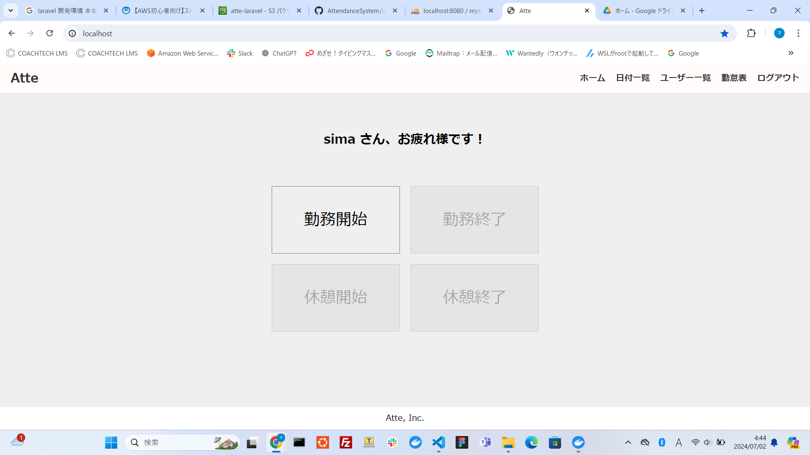
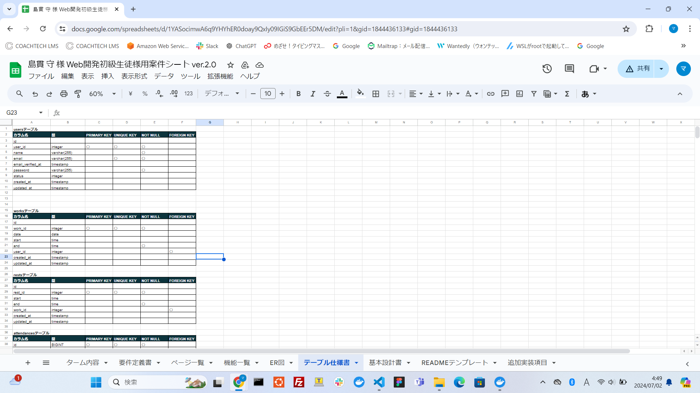
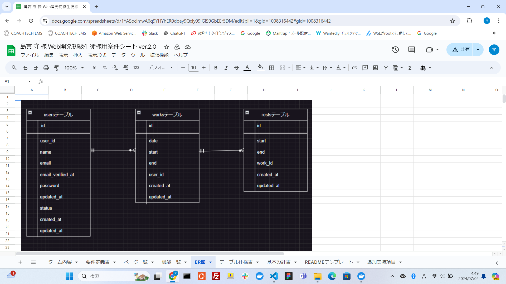

# Atte

# 勤怠管理システム
勤怠管理システムを作成してみました。  
ログイン後、ボタン打刻で勤務開始/終了時間と休憩開始/終了時間を管理していきます。  

## 作成した目的
勉強の開発案件の実習課題勉強として作成

## アプリケーションURL
未作成

## 機能一覧
ログイン機能、勤務状態によるボタン制御、勤務時間/休憩時間管理、日付別勤怠管理、ユーザー別勤怠管理

## 仕様技術
Laravel 8.83.27

## テーブル設計

## ER図

## 備考
## テストユーザーアカウント種類
## test0923@gmail.com
## パスワード test0923
